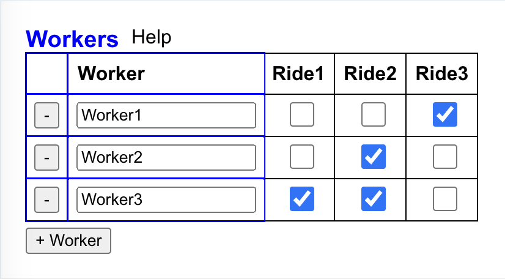
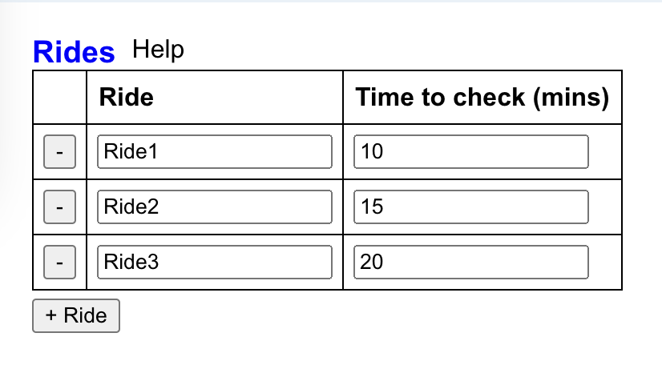
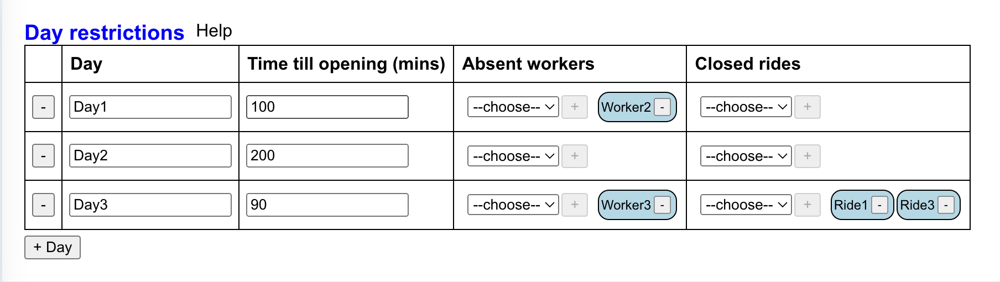
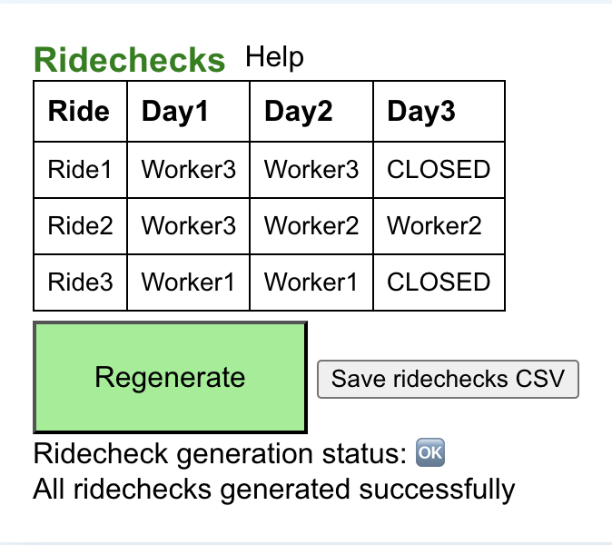
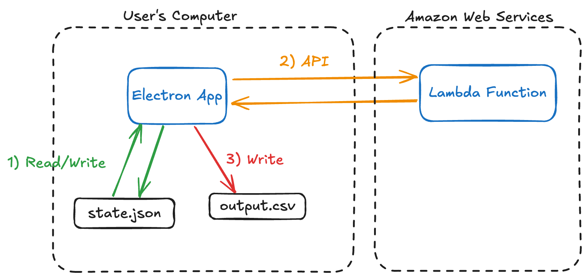

# About

This repository contains the source code for an Electron application (located in the `electron-app` folder) and an associated API (located in the `python-assigner` folder) that the Electron application calls. The goal of this software is to allow its user to generate an assignment of workers to tasks.

### Basic example

Suppose this software is used by a factory manager, whose factory has 10 tasks, each taking 5 minutes, and employs 2 workers. The factory manager wants to deploy the aformentioned workers to complete all tasks in 25 minutes. The software assumes that the workers can complete tasks concurrently, and each task can be completed independently of every other task, and would therefore assign each worker to 5 tasks. This means that each worker works for 25 minutes (5 tasks * 5 minutes); together, the workers are able to complete all of the tasks in the allotted time. If the factory manager allotted 20 minutes, the software would notify the factory manager that no worker assignment is possible such that all tasks are completed in the alloted time.

### UI explanation

The software features four tables: three tables that allow the user to modify the worker and task parameters (input tables), and one table displaying task assignments. Instead of just generating one assignment, the software supports generating mutliple assignments for multiple days because this is more convenient to the user.

The first input table allows the user to specify which tasks each worker can perform. 

.

The second input table allows the editing of task durations. 

The third input table allows the editing of the total allotted time for each day, and allows each day to have slight variations between them  with the "closed rides" (rides=tasks) and "absent workers" columns: on a given day, some tasks or some workers might not be available.

Here's the assignments that the software generates based on the specific information contained in the 3 input tables above:

 
 

# Technical information

(Diagram made using https://excalidraw.com/)

Each user has their own instance of the Electron application, with their own `state.json` file for the Electron application's state, and all users access the same API.

Typically, the software does the following:
1. Read the app state when the app loads from the `state.json` file. Modify the app state using the user interface.
2. When the app state reflects what the user wants, the app makes an API call. The API call is a POST request with the JSON app state in the body, and the lambda function returns a JSON response, with either an error string or the assignments.
3. The user can save the assignments locally as a CSV file in case they want to edit them in a spreadsheet application.

### Technology stack

The stack:
- The Electron application, which runs locally on the user's computer. All Electron applications run as at least two processes that communicate with each another: 
    - One main process, which has access to operating system features such as saving files to the filesystem. This process is interpreted by Node.js. 
    - At least one renderer process, which is spawned by the main process. I'm oversimplifying, but this renderer process has a mini-browser inside of it, and it understands JavaScript/HTML/CSS for browsers. In my case, I'm developing code for the renderer process using React, a very popular modern JavaScript framerwork. My main process only spawns one renderer process, since the application only needs one window, and does not require any web-based background tasks.

*FIXME this is unnecessary because using Node.js child_process module is better*

- An AWS Lambda triggered via  AWS API Gateway, which runs on Amazon's servers. The Lambda computes the assignment by using the  [python-constraint](https://github.com/python-constraint/python-constraint) module, specifically the `MinConflictsSolver` class.

### Electron application 

To setup the boilerplate for the Electron application, I followed instructions from https://mmazzarolo.com/blog/2021-08-12-building-an-electron-application-using-create-react-app/. 

That blog describes how to modify source code for a web application in order to use it in an Electron desktop application. The blog mainly helped me to:
- Add code (`electron-app/public/electron.js`) which implements the Electron main process.

*FIXME and what does this main process do?*

- Add code (`electron-app/public/preload.js`) which specifies  how the Electron main process can communicate with the renderer process. This is described as an optional step in the blog, but has become a mandatory step since the blog's publication due to stricter security enforcement in the new Electron version.
- Run and package the Electron app by installing the necessary packages and updating the `electron-app/package.json`.

### How the user interface works

The UI is implemented in React. React is a component-based framework where each component can have a state. The following section assumes some knowledge of React.

My design has one App component with the app state. This component contains all of the information that is saved into the `state.json` file. The App component has four EditableTable components as children, which read and write to the app state (always modified set using `setAppState`). The way that the EditableTable components read and write to the app state is via two props: 
1. Prop for reading application state: Some part of the application state is passed as a prop. 
2. Prop for writing to application state: A callback function that calls `setAppState` in a particular way. 

When one of the EditableTable components updates the app state, this potentially rerenders its sibling EditableTable components, keeping them in sync.

Here's how it works:
1. "EditableTable A" calls its callback prop and update App's state.
2. This triggers App to rerender. 
3. During App's rerender, the prop for reading application state passed to the siblings of "EditableTable A" may be changed.
4. If the sibling's prop was changed, it rerenders.

### Design of app state

`electron-app/src/appStateUtilities.js` specifies the default state object and provides functions for updating it. The state always has:
- Rides array
- Workers array
- Day restrictions array
- Ridechecks array

FIXME explain the rows in the table converting to state updates

### Constraint satisfaction problem

The point of all this software is to provide inputs to a constraint satisfaction problem (CSP), a type of mathematical problem. Sudoku and crosswords are types of CSPs. 

*FIXME show diagram or a concrete example, describing how tasks take time*

*FIXME CSP should be explained earlier, when you're explaining the basic example*

The problem can be defined by treating each task as a variable that has a discrete domain of workers. For example, the variable "maintaining the converyor belt" has a domain of ["alex", "george", and "kevin"]. Then, choose a worker for each task (assign a value to the variable) such that the workers have time to complete all of their assigned tasks. Formally, each worker has a constraint: the total time of all the tasks that they are assigned cannot exceed a certain value.

The python-constraint library supports multiple "Solvers": Python classes implementing various solving techniques. The default solver uses backtracking search, but I chose to use the solver that uses minimum-conflicts hill-climbing. This technique is more suitable in my scenario because it provides a random satisfying assignment as opposed to the same assignment each time. The min-conflicts solver works by choosing a random task and assigning a worker to it that minimizes the number of unsatisfied constraints i.e. conflicts. This means that workers are more likely to cycle through tasks and not be constantly assigned to the same task, reducing worker fatigue.

*FIXME need links to CSP and details*

You can find the definition and execution of the CSP on lines 62 to 83 of `python-assigner/lambda_function.py`.