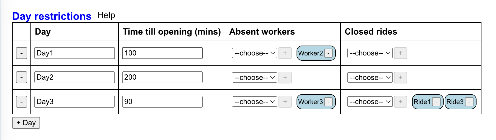

# About

The goal of this software is to allow an amusement park manager to generate daily inspection schedules, known as ridechecks. Each day before amusement park rides open to the public, each ride must be checked by a qualified mechanic. To generate a daily inspection schedule, the amusement park manager must enter the following:
- How much time is there before the amusement park opens to the public?
- How much time does each ride take to check?
- Which mechanics are available and what rides are they qualified to check?

The amusement park manager enters the necessary information to generate inspection schedules into editable tables, then inspection schedules are made available to the amusement park manager to download as a CSV file.

The software is a desktop application developed with Electron and React, and is currently only available for Windows.

Here's how ridechecks look in the application:

### Constraint satisfaction problem

Generating an inspection schedule can be formalized as a [constraint satisfaction problem (CSP)](https://en.wikipedia.org/wiki/Constraint_satisfaction_problem), a type of mathematical problem. Sudoku and crosswords are types of CSPs. 

The problem can be defined by treating each amusement park ride as a variable that has a discrete domain of workers. For example, the variable "wooden roller coaster" has a domain of ["alex", "julia", and "kevin"], meaning it can be inspected by one of those workers. Then, choose a worker for each ride (assign a value to the variable) such that the workers have time to complete all of their assigned rides. Formally, each worker has a constraint: the total time of all the rides that they are assigned cannot exceed a certain value.

The [python-constraint library](https://github.com/python-constraint/python-constraint) supports multiple "Solvers": Python classes implementing various solving techniques. The default solver uses backtracking search, but I chose to use the solver that uses [minimum-conflicts hill-climbing](https://en.wikipedia.org/wiki/Min-conflicts_algorithm). This technique is more suitable in my scenario because it provides a random satisfying assignment as opposed to the same assignment each time. The min-conflicts solver works by choosing a random ride and assigning a worker to it that minimizes the number of unsatisfied constraints i.e. conflicts. This means that workers are unlikely to be assigned to the same ride the next time an assignment is generated, which reduces worker fatigue.

For example, suppose we have the following scenario:
- Wooden: takes 12 mins, domain Ashley, Ivan, John
- Spinny: 15 mins, domain John, Ivan
- Ferris: 5 mins, domain Ivan
- Pirate: 5 mins, domain Ashley, Ivan, John

Max work time is 15 mins.

Using min-conflicts, we start with a random assignment of rides to one of the workers that can do that ride.

| Wooden | Spinny | Ferris | Pirate | 
| ----- | ---- | --- | ----- | 
| Ashley | Ivan | Ivan | Ashley |

In this case, there are two conflicts:
1. Ashley works for 12 + 5 = 17 minutes (17 > 15)
2. Ivan works for 20 minutes (20 > 15)

Then we choose a random ride, for simplicity "Spinny", and assign it a value that minimizes the number of conflicts. Assigning "Spinny" to John causes there to only be one conflict:
1. Ashley works for 17 minutes (17 > 15)

| Wooden | Spinny | Ferris | Pirate | 
| ----- | ---- | --- | ----- | 
| Ashley | John | Ivan | Ashley |

Then we luckily choose another random ride, "Wooden", and assign it to Ivan. Now there are no conflicts because all workers work for max 15 minutes.

| Wooden | Spinny | Ferris | Pirate | 
| ----- | ---- | --- | ----- | 
| Ashley | John | Ivan | Ivan |

You can find the definition and execution of the CSP on lines 62 to 83 of `python-assigner/lambda_function.py`.

### UI explanation

The software features four tables: three tables that allow the user to modify the worker and ride parameters (input tables), and one table displaying ride assignments. Instead of just generating one assignment, the software supports generating mutliple assignments for multiple days because this is more convenient to the user.

The first input table allows the user to specify which rides each worker can perform. 

.

The second input table allows the editing of ride durations. 

The third input table allows the editing of the total allotted time for each day, and allows each day to have slight variations between them  with the "closed rides" and "absent workers" columns: on a given day, some rides or some workers might not be available.

Here's the assignments that the software generates based on the specific information contained in the 3 input tables above:

 
 

# Technical information

(Diagram made using https://excalidraw.com/)

Each user has their own instance of the Electron application, with their own `state.json` file for the Electron application's state, and all users access the same API.

Here are the main events that the software responds to:
1. When it loads: read the state from the `state.json` file. 
2. When user edits table in the UI: Modify the app state.
2. When user clicks "regenerate" button: App makes API call, a POST request with the JSON app state in the body, and the lambda function returns a JSON response, with either an error string or the assignments.
3. When user clicks "save" button: App opens OS save dialog, allowing the user to save the assignments locally as a CSV file in case they want to edit them in a spreadsheet application or just for recordkeeping.

### Technology stack

The stack:
- The Electron application, which runs locally on the user's computer. All Electron applications run as at least two processes that communicate with each another: 
    - One main process, which has access to operating system features such as saving files to the filesystem. This process is interpreted by Node.js. 
    - At least one renderer process, which is spawned by the main process. I'm oversimplifying, but this renderer process has a mini-browser inside of it, and it understands JavaScript/HTML/CSS for browsers. In my case, I'm developing code for the renderer process using React. My main process only spawns one renderer process, since the application only needs one window, and does not require any web-based background tasks.

- An AWS Lambda triggered via  AWS API Gateway, which runs on Amazon's servers. The Lambda computes the assignment by using the [python-constraint](https://github.com/python-constraint/python-constraint) module, specifically the `MinConflictsSolver` class. Another way to use the python-constraint library from inside Electron would be with the Node.js [child_process](https://nodejs.org/api/child_process.html) module, starting either:
    - `python3 my_script.py` (would have to embed a python interpreter)
    - `executable_from_script` (generated via pyinstaller or similar) 

    as a child process.

### Electron application 

To setup the boilerplate for the Electron application, I followed instructions from https://mmazzarolo.com/blog/2021-08-12-building-an-electron-application-using-create-react-app/. 

That blog describes how to modify source code for a web application in order to use it in an Electron desktop application. The blog mainly helped me to:
- Add code (`electron-app/public/electron.js`) which implements the Electron main process.
- Add code (`electron-app/public/preload.js`) which specifies how the Electron main process can communicate with the renderer process. This is described as an optional step in the blog, but has become a mandatory step since the blog's publication due to security policies in the new Electron version.
- Run and package the Electron app by installing the necessary packages and updating the `electron-app/package.json`.

Besides spawning the renderer process, the main process handles:
- Reading/writing from state.json file.
- Save dialog for saving the assignments as a CSV.

These tasks are OS-related and the renderer process does not have permission to perform these tasks. They have to be implemented in the main process.

### How the user interface works

The UI is implemented in React. React is a component-based framework where each component can have a state. The following section assumes some knowledge of React.

My design has one App component with the app state. This component contains all of the information that is saved into the `state.json` file. The App component has four EditableTable components as children, which read and write to the app state (always modified set using `setAppState`). The way that the EditableTable components read and write to the app state is via two props: 
1. Prop for reading application state: Some part of the application state is passed as a prop. 
2. Prop for writing to application state: A callback function that calls `setAppState` in a particular way. 

When one of the EditableTable components updates the app state, this potentially rerenders its sibling EditableTable components, keeping them in sync.

Here's how it works:
1. "EditableTable A" calls its callback prop and update App's state.
2. This triggers App to rerender. 
3. During App's rerender, the prop for reading application state passed to the siblings of "EditableTable A" may be changed.
4. If the sibling's prop was changed, it rerenders.

### Design of app state

`electron-app/src/appStateUtilities.js` specifies the default state object and provides functions for updating it. The state always has:
- Rides array, containing Ride objects. Each ride object has
    - Name (strings)
    - Time (number)
- Workers array, containing Worker objects. Each worker object has
    - Name (string)
    - CanCheck (list of ride names, which are strings)
- Day restrictions array, containing DayRestriction objects. Each has
    - Day (string, the name of the day)
    - Time (number, how long the workers have to complete their tasks on that day)
    - ClosedRides (list of ride names, which are strings)
    - AbsentWorkers (list of worker names, which are strings)
- Ridechecks array, containing Ridecheck objects. Each has
    - Day (string, the name of the day)
    - A ridecheck object, which is used as a map from ride to worker names.

The state was chosen to be easily serializable to JSON. I originaly had a simpler state which didn't allow duplicate ride or worker names: there were no ride objects or worker objects in an array, just name keys to Time or CanCheck values. That caused issues with worker names that were substrings of other worker names, for example Alex and Alexa, since an object cannot have duplicate keys.
